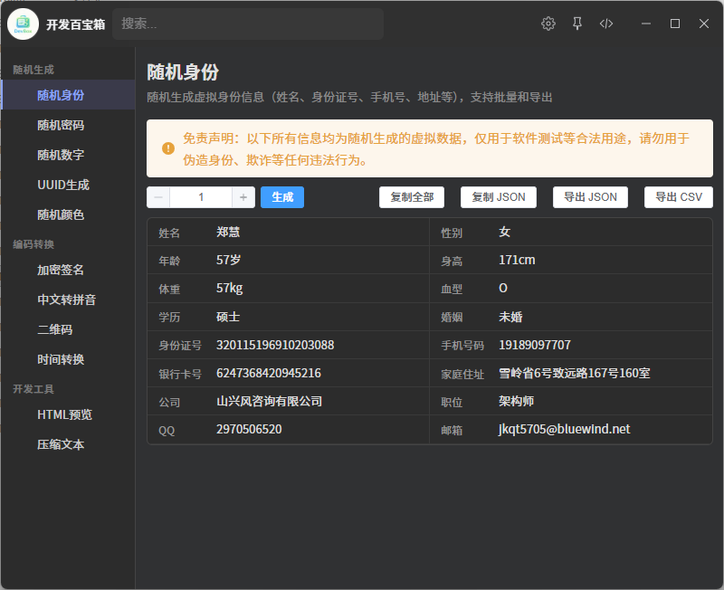

# 开发百宝箱 (devbox)

一款集成在 ZTools 中的实用工具箱，提供随机生成、编码转换、开发辅助等常用工具。



## 最近更新

### v2.3.3 (2026-05-20)

- 新增 **压缩文本** 工具：将多行文本的换行和多余空格压缩为单个空格，支持移除代码注释、保留引号内空格、按指定宽度智能折行。触发指令：`压缩文本` `compress`。

## 工具列表

| 分类 | 工具 | 触发指令 |
|------|------|----------|
| **随机生成** | 随机身份 | `身份` `身份证` `identity` |
| | 随机密码 | `密码` `password` |
| | 随机数字 | `随机数字` `number` |
| | UUID生成 | `UUID` `guid` |
| | 随机颜色 | `颜色` `color` |
| **编码转换** | 加密签名 | `签名` `hash` `md5` `sha` |
| | 中文转拼音 | `拼音` `pinyin` |
| | 二维码 | `二维码` `qrcode` `qr` |
| | 时间转换 | `时间` `时间戳` `time` |
| **开发工具** | HTML预览 | `html` `HTML预览` |
| | 压缩文本 | `压缩文本` `compress` |

## 使用方式

1. 在 ZTools 搜索栏输入上述任意触发指令
2. 或在 ZTools 主界面点击「开发百宝箱」图标进入

---

## 开发者说明

> 以下内容面向插件开发者，普通用户无需关注。

### 技术栈

- Vue 3 + Vite + TypeScript
- Element Plus UI 组件库

### 项目结构

```
src/
├── tools/                    # 工具组件目录
│   ├── Identity/            # 随机身份
│   ├── RandomPassword/      # 随机密码
│   ├── RandomNumber/        # 随机数字
│   ├── UUID/                # UUID 生成
│   ├── RandomColor/         # 随机颜色
│   ├── Signature/           # 加密签名
│   ├── Pinyin/             # 中文转拼音
│   ├── HTMLPreview/         # HTML 预览
│   ├── TimeConvert/         # 时间转换
│   └── TextCompress/        # 压缩文本
├── toolbox/
│   ├── ToolboxLayout.vue   # 布局组件
│   └── tools.ts            # 工具注册表
└── App.vue                  # 根组件

public/
├── plugin.json              # 插件配置
├── logo.png                # 插件图标
└── preload/
    └── services.js         # Node.js 桥接服务
```

### 开发命令

```bash
npm install     # 安装依赖
npm run dev     # 启动开发服务器（http://localhost:5173）
npm run build   # 构建生产版本
```

### 添加新工具

1. 在 `src/tools/<ToolName>/index.vue` 创建 Vue 组件
2. 在 `src/toolbox/tools.ts` 的 `categories` 数组中注册
3. 在 `public/plugin.json` 的 `features` 数组中添加配置

### 配置文件

编辑 `public/plugin.json` 可修改插件名称、描述、版本及功能配置。每个功能的 `cmds` 数组定义了触发指令列表。
