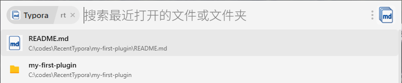

# Recent Typora

一个模仿 uTools 的 QuickTypora 插件的 ZTools 插件，用于读取 Typora 的最近打开的文件和文件夹，并按最近打开时间顺序列出，支持windows，linux和macos。

QuickTypora 插件地址：https://www.u-tools.cn/plugins/detail/QuickTypora/

此插件内容完全由codex生成，已在windows 10上得到测试。linux和macos上尚未得到测试。

## 截图



## 使用方法

1. 在 ZTools 开发者工具中加载本目录。
2. 输入 `rt`、`typo` 或 `recent typora`，回车进入插件。
3. 在列表中选择最近文件或文件夹，回车后使用 Typora 打开。
4. 可在插件顶部的搜索框中按名称或路径筛选。

修改代码或配置后，如果效果没有更新，请从系统托盘彻底退出并重新启动 ZTools。ZTools 可能会保留已加载的 Preload 进程。

## 功能

- 合并显示 Typora 最近打开的文件和文件夹
- 按最近打开时间从新到旧排序
- 在插件内部按名称或完整路径搜索
- 使用不同图标区分 Markdown 文件与文件夹
- 选择任一项目后，显式使用 Typora 打开
- 每次进入或搜索时重新读取历史记录，不缓存数据
- 只读访问 `history.data`，不会修改 Typora 数据

## Typora 历史文件位置

插件默认查找：

- Windows：`%APPDATA%\Typora\history.data`
- Linux：`${XDG_CONFIG_HOME:-~/.config}/Typora/history.data`
- macOS：`~/Library/Application Support/abnerworks.Typora/history.data`
- macOS 兼容路径：`~/Library/Application Support/Typora/history.data`

如果历史文件位于其他位置，可在启动 ZTools 前设置：

```text
TYPORA_HISTORY_PATH=history.data 的完整路径
```

目前确认的数据格式是“UTF-8 JSON 转十六进制文本”。解析器同时兼容 Base64 和明文 JSON。文件记录通常使用毫秒时间戳，文件夹记录可能使用 ISO 日期字符串，插件会统一转换后排序。

## 插件如何启动 Typora

- Windows：依次检查常见的系统级和用户级安装目录。
- Linux：执行 `typora "目标路径"`，因此 `typora` 需要位于 `PATH` 中。
- macOS：执行 `open -a Typora "目标路径"`。

对于便携版或自定义安装，可设置：

```text
TYPORA_EXECUTABLE=Typora 可执行文件的完整路径
```

macOS 使用该变量时，应指向应用内部的可执行文件，而不只是 `Typora.app` 目录。

## 项目文件

- `plugin.json`：插件信息、功能入口和触发指令
- `preload.js`：历史解析、列表模式和 Typora 启动逻辑
- `test.js`：解析、排序、图标、路径和启动命令测试
- `logo.png`：插件入口图标
- `folder-icon.png`：文件夹列表图标
- `markdown-icon.png`：Markdown 文件列表图标

## 安装依赖与测试

本插件不需要编译，也没有 `dev` 或 `build` 步骤。

```bash
npm install
npm test
```

`npm test` 只负责验证代码；实际运行需要由 ZTools 加载此目录。

